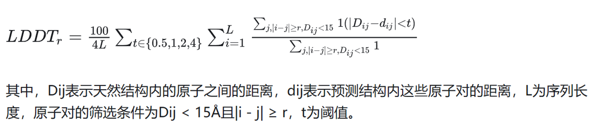

# lDDT

## Introduction

### Motivation

传统的相似性度量方法依赖于Cα原子的全局叠加，受到**域运动**(domain motions)的强烈影响，**无法准确评估模型中局部原子细节的准确性**。在这种情况下，全局刚体叠加通常由最大的结构域主导，导致较小的结构域无法正确匹配，从而产生人为的偏低评分。

### Other metrics

**RMSD** 有几个特性限制了其在结构预测评估中的实用性：

1. 受差异较大的错误预测区域的影响
2. 对模型中缺失的部分不敏感
3. 它在很大程度上依赖于模型与参考结构的叠加

GDT克服了RMSA的前两个缺点：

1. 偏差较大的原子不会显著影响评分
2. 预测中缺失的片段会导致评分降低

## Formula

lDDT(Local Distance Difference Test)通过计算参考结构中所有距离小于预定义阈值 Ro（称为包含半径）且不属于同一残基的原子对来实现。这些原子对定义了一组局部距离 L。如果模型 M 中的距离在某个容差阈值内与 L 中相应的距离相同，则认为该距离被保留。如果定义距离的一个或两个原子在模型 M 中不存在，则该距离被认为未被保留。对于给定的阈值，计算保留距离的比例。最终的 lDDT 得分是使用 0.5Å、1Å、2Å 和 4Å 四个阈值计算的比例的平均值。（四个阈值）

lDDT 得分可以使用预测中的所有原子来计算，也可以只使用 Cα 原子之间或主链原子之间的距离。通过指定一个最小序列分离参数，可以排除相邻残基之间的相互作用。lDDT默认使用 Ro = 15Å，且使用了序列分离为零的所有原子。（三个参数：Ro, 最小序列分离参数，使用的原子）

具体公式：

## Stereochecks

立体化学检查包含以下几个方面：

- **立体化学违规(stereochemical violations)**：**键长和键角**的值与从高分辨率实验结构（Engh 和 Huber，1991，2006）中导出的平均参考值相比，偏离超过预定义的标准差数量（默认 12 个标准差）。
- **原子碰撞（clash）**：**非键合原子对之间的距离**小于其对应的原子范德华半径之和（Allen，2002），且在预定义的容差阈值（默认 1.5Å）范围内，则这些原子对被视为存在冲突。可以为每对原子元素独立定义容差阈值。
    > 两个非键合原子之间的原子范德华半径之和为它们之间的极限距离。
    > [Engh,R.A. and Huber,R. (1991)](https://www.sci-hub.ru/10.1107/S0108767391001071), [Engh,R.A. and Huber,R. (2006)](https://onlinelibrary.wiley.com/iucr/itc/Fb/ch18o3v0001/)
    > [Allen (2002)](https://www.sci-hub.ru/10.1107/s0108768102003890)

- 如果某个残基的侧链原子表现出立体化学违规或空间冲突，则该残基所有包含任何侧链原子的距离在 lDDT 计算中都将被视为未保留。
    > 未保留就是negative
- 如果主链原子涉及立体化学违规或空间冲突，则该残基中包含任何原子的所有距离都将被视为未保留。

经过上述检查之后，有违规或冲突的原子对会被排除（在公式里只作为分母）。
